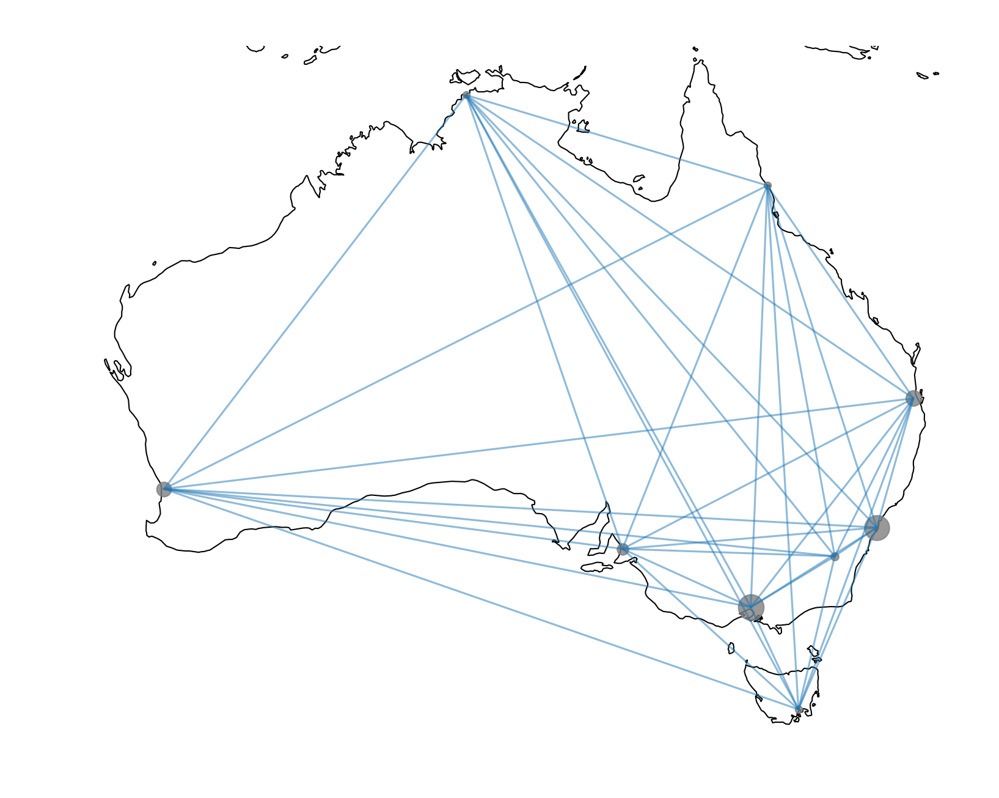
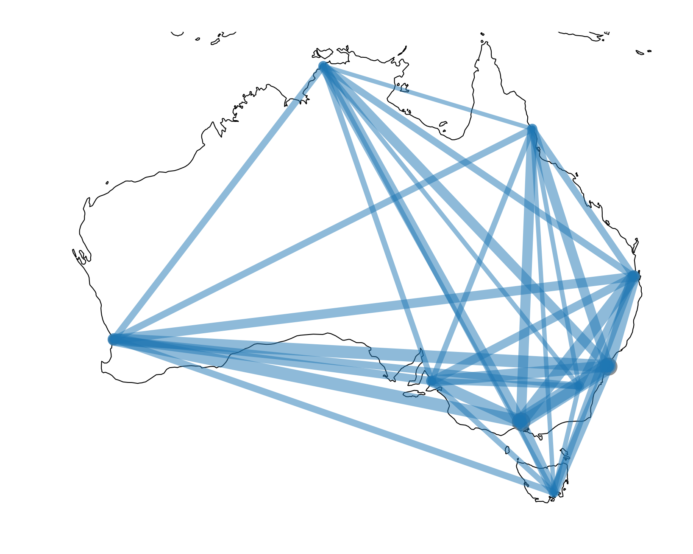
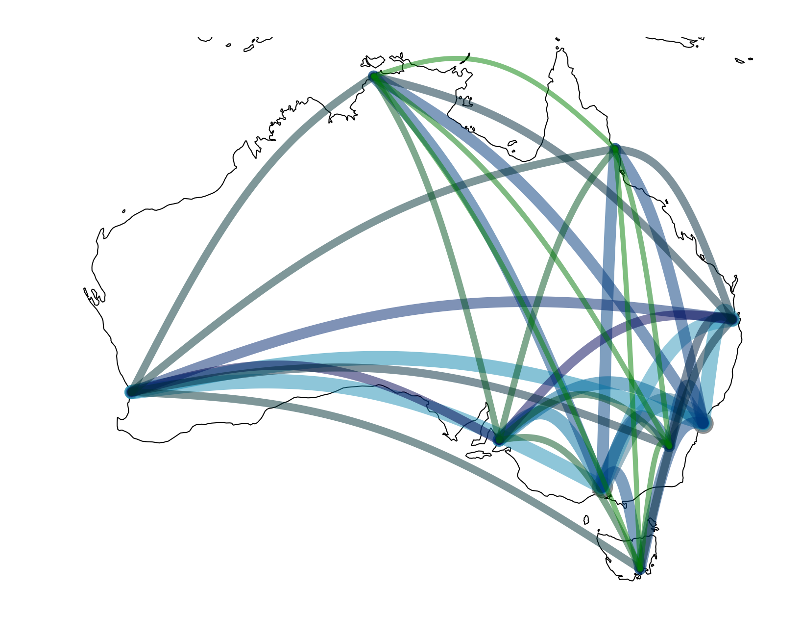
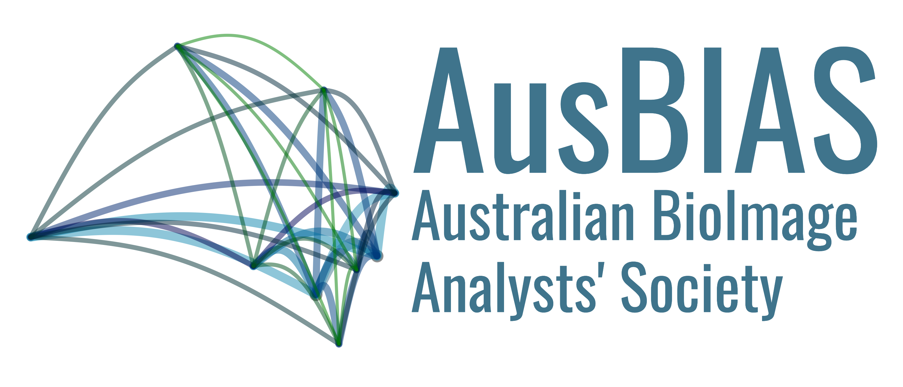

# What's a society without a logo? 

When we first decided we needed a website, the first question was obviously: what should our logo be. 

At first I wanted something quickly, and took the obvious route of paying homage (shamelessly plaigerising) the GloBIAS Logo:
{: height="200" }

In a fit of ... what's the opposite of creatitvity... I created this monstrosity: 
{: height="200" }
My thoughts were: 
    - change the colours to "Aussie it up a bit" 
    - highlight the bottom right, where we usually appear on a map of the world. 

After all this, I decided it was best to actually ask permission from the GloBIAS organising committee and, while flattered, they were somewhat concerned about protecting their brand now that they're a legal entity. This was entirely justified so back to the drawing board for me.

Next I looked at the Neubias logo: 
{: height="200" }
Well I liked the look of the network there, so that's where I started tinkering. 

First - I found a csv file with the latitude and longitude of the major cities in Australia, including their populations as well. Then wrote a script to put a population sized dot on each and connect them with lines.
{: height="200" }

That was cool and all, but as I had scaled the Cities to the population, why not do the same with the lines? 

I still wasn't happy so decided to curve the lines, and add a colour map: 

That was it. Thought to make it more abstract I'd remove the coastline, had a design-minded friend help chose a font and the rest is (extremely recent) history:

If you want to generate the logo yourself, all the code is in [our github](https://github.com/ausbias)! 
